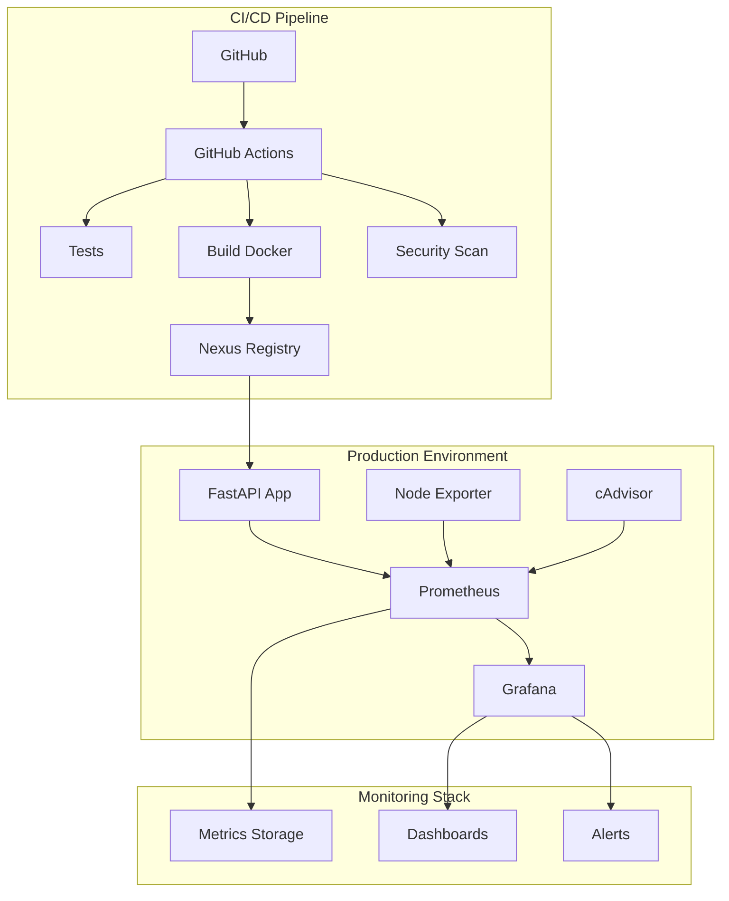

# 🚀 Store Management API - Proyecto DevOps

[](https://github.com/your-org/artefacts_devops/actions)
[](https://hub.docker.com/r/your-org/store-management-api)
[](https://www.python.org/downloads/)
[](https://fastapi.tiangolo.com/)

## 📋 Descripción

Este proyecto es una API REST desarrollada con FastAPI para la gestión de clientes, productos y ventas, implementada siguiendo las mejores prácticas de DevOps. Incluye una arquitectura completa de CI/CD, monitoreo, containerización y despliegue automatizado.

### 🎯 Objetivos del Proyecto

- **Desarrollo**: API REST funcional para gestión de tienda
- **Containerización**: Dockerfile optimizado con mejores prácticas de seguridad
- **CI/CD**: Pipeline automatizado con GitHub Actions
- **Monitoreo**: Integración con Prometheus y Grafana
- **Repositorio de Artefactos**: Nexus Repository Manager
- **Despliegue**: Scripts automatizados para diferentes entornos

## 🏗️ Arquitectura



## 🚀 Inicio Rápido

### Prerrequisitos

- Docker 20.10+
- Docker Compose 2.0+
- Python 3.11+
- Git

### 1. Clonar el Repositorio

```bash
git clone https://github.com/your-org/artefacts_devops.git
cd artefacts_devops
```

### 2. Desarrollo Local

```bash
# Crear entorno virtual
python -m venv venv
source venv/bin/activate  # Linux/Mac
# venv\Scripts\activate  # Windows

# Instalar dependencias
pip install -r requirements.txt

# Ejecutar la aplicación
cd app
python -m uvicorn main:app --reload --host 0.0.0.0 --port 8000
```

### 3. Usando Docker Compose (Recomendado)

```bash
# Iniciar todos los servicios
docker-compose up -d

# Ver logs
docker-compose logs -f fastapi-app

# Parar servicios
docker-compose down
```

## 📡 Endpoints de la API

### Health Check
- `GET /api/v1/health` - Estado de la aplicación
- `GET /metrics` - Métricas de Prometheus

### Clientes
- `POST /api/v1/clients` - Crear cliente
- `GET /api/v1/clients` - Listar clientes

### Productos
- `POST /api/v1/products` - Crear producto
- `GET /api/v1/products` - Listar productos

### Ventas
- `POST /api/v1/sales` - Registrar venta
- `GET /api/v1/sales` - Listar ventas

### Documentación
- `GET /docs` - Swagger UI
- `GET /redoc` - ReDoc

## 🐳 Docker

### Construcción de Imagen

```bash
# Construir imagen
docker build -t store-management-api .

# Ejecutar contenedor
docker run -p 8000:8000 store-management-api
```

### Multi-stage Build

El Dockerfile utiliza construcción multi-etapa para optimizar el tamaño de la imagen:

- **Builder Stage**: Instala dependencias
- **Production Stage**: Imagen final optimizada

### Seguridad

- Usuario no-root
- Imagen base slim
- Health checks incluidos
- Variables de entorno seguras

## 🔧 Configuración

### Variables de Entorno

```bash
# Aplicación
ENVIRONMENT=production
LOG_LEVEL=INFO

# Registry
REGISTRY_URL=localhost:8085
IMAGE_TAG=latest

# Nexus
NEXUS_USERNAME=cicd-user
NEXUS_PASSWORD=your-password

# Grafana
GRAFANA_ADMIN_USER=admin
GRAFANA_ADMIN_PASSWORD=admin123
GRAFANA_DOMAIN=localhost
```

## 📊 Monitoreo

### Prometheus

- **URL**: http://localhost:9090
- **Configuración**: `prometheus/prometheus.yml`
- **Targets**: FastAPI, Node Exporter, cAdvisor

### Grafana

- **URL**: http://localhost:3000
- **Usuario**: admin
- **Contraseña**: admin123
- **Dashboards**: Pre-configurados para la aplicación

### Métricas Disponibles

- `http_requests_total` - Total de requests HTTP
- `http_request_duration_seconds` - Latencia de requests
- Métricas del sistema (CPU, memoria, disco)
- Métricas de contenedores Docker

## 🔄 CI/CD Pipeline

### Workflows

El pipeline de GitHub Actions incluye:

1. **Testing**: Pruebas automáticas con pytest
2. **Linting**: Análisis de código con flake8
3. **Security**: Escaneo con bandit y Trivy
4. **Build**: Construcción de imagen Docker
5. **Publish**: Publicación en Nexus Registry
6. **Deploy**: Despliegue automatizado

### Triggers

- Push a `main` o `develop`
- Pull requests
- Releases

### Secrets Requeridos

```
NEXUS_USERNAME
NEXUS_PASSWORD
SLACK_WEBHOOK (opcional)
```

## 🏪 Nexus Repository

### Configuración Inicial

```bash
# Ejecutar configuración automática
./scripts/setup-nexus.sh
```

### Repositorios Creados

- **docker-hosted** (puerto 8085): Imágenes propias
- **docker-hub** (proxy): Proxy para Docker Hub
- **docker-group** (puerto 8086): Agregador

### Login al Registry

```bash
docker login localhost:8085 -u cicd-user -p cicd-password-123
```

## 🚚 Despliegue

### Script Automatizado

```bash
# Despliegue a producción
./scripts/deploy.sh production latest

# Despliegue específico
./scripts/deploy.sh staging v1.2.3
```

### Entornos Soportados

- **Local**: Docker Compose
- **Staging**: Servidor local/VM
- **Production**: AWS EC2 (configurable)

### Estrategia Blue-Green

El script de despliegue implementa:

- Backup automático del estado actual
- Despliegue gradual de servicios
- Health checks automatizados
- Rollback automático en caso de falla

## 🧪 Testing

### Ejecutar Tests

```bash
# Ejecutar todos los tests
pytest

# Con coverage
pytest --cov=app --cov-report=html

# Tests específicos
pytest tests/test_main.py::TestClients
```

### Tipos de Tests

- **Unit Tests**: Funcionalidad de endpoints
- **Integration Tests**: Interacción entre componentes
- **Health Checks**: Verificación de servicios
- **Metrics Tests**: Validación de métricas

## 📈 Git Flow

### Branching Strategy

```
main (production)
├── develop (development)
├── feature/nueva-funcionalidad
├── release/v1.2.0
└── hotfix/bug-critico
```

### Proceso de Release

1. Crear branch `release/vX.Y.Z` desde `develop`
2. Realizar testing final y ajustes
3. Merge a `main` y tag de versión
4. Merge back a `develop`

### Versionado Semántico

- **MAJOR**: Cambios incompatibles
- **MINOR**: Nueva funcionalidad compatible
- **PATCH**: Bug fixes compatibles

## 🛠️ Desarrollo

### Setup del Entorno

```bash
# Instalar dependencias de desarrollo
pip install -r requirements.txt
pip install flake8 black isort

# Pre-commit hooks
pre-commit install
```

### Estándares de Código

- **Formato**: Black
- **Import sorting**: isort
- **Linting**: flake8
- **Type hints**: mypy (opcional)

### Estructura del Proyecto

```
artefacts_devops/
├── app/                    # Código de la aplicación
│   ├── __init__.py
│   ├── main.py            # Punto de entrada
│   ├── routes.py          # Endpoints de la API
│   └── metrics.py         # Configuración de métricas
├── tests/                 # Tests automáticos
├── scripts/               # Scripts de automatización
├── prometheus/            # Configuración de Prometheus
├── grafana/              # Configuración de Grafana
├── .github/workflows/    # Pipelines CI/CD
├── Dockerfile            # Imagen de la aplicación
├── docker-compose.yaml   # Orquestación local
├── docker-compose.prod.yml # Orquestación producción
└── requirements.txt      # Dependencias Python
```

## 🔒 Seguridad

### Mejores Prácticas Implementadas

- **Container Security**: Usuario no-root, imagen minimal
- **Secrets Management**: Variables de entorno, no hardcoding
- **Network Security**: Redes aisladas en Docker
- **Dependency Scanning**: Vulnerabilidades automáticas
- **Code Analysis**: Análisis estático con bandit

### Escaneo de Vulnerabilidades

```bash
# Escaneo de dependencias Python
pip-audit

# Escaneo de imagen Docker
trivy image store-management-api:latest
```

## 📝 Troubleshooting

### Problemas Comunes

#### 1. Error de permisos en Docker

```bash
sudo usermod -aG docker $USER
newgrp docker
```

#### 2. Nexus no responde

```bash
# Verificar logs
docker logs nexus-repository

# Reiniciar servicio
docker-compose restart nexus
```

#### 3. Métricas no aparecen en Grafana

```bash
# Verificar conectividad a Prometheus
curl http://localhost:9090/api/v1/targets

# Recargar configuración
curl -X POST http://localhost:9090/-/reload
```

### Logs y Debugging

```bash
# Logs de la aplicación
docker-compose logs -f fastapi-app

# Logs de todos los servicios
docker-compose logs

# Métricas en tiempo real
curl http://localhost:8000/metrics
```

## 🤝 Contribución

### Proceso

1. Fork del repositorio
2. Crear feature branch: `git checkout -b feature/nueva-funcionalidad`
3. Commit cambios: `git commit -am 'Add nueva funcionalidad'`
4. Push branch: `git push origin feature/nueva-funcionalidad`
5. Crear Pull Request

### Guidelines

- Seguir estándares de código
- Agregar tests para nueva funcionalidad
- Actualizar documentación
- Mantener commits atómicos

## 📄 Licencia

Este proyecto está bajo la Licencia MIT - ver el archivo [LICENSE](LICENSE) para detalles.

## 👥 Autores

- **Tu Nombre** - *Desarrollo inicial* - [tu-usuario](https://github.com/tu-usuario)

## 🙏 Agradecimientos

- FastAPI por el framework web
- Prometheus/Grafana por el stack de monitoreo
- Docker por la containerización
- GitHub Actions por CI/CD

---

## 📚 Enlaces Útiles

- [FastAPI Documentation](https://fastapi.tiangolo.com/)
- [Docker Best Practices](https://docs.docker.com/develop/dev-best-practices/)
- [Prometheus Monitoring](https://prometheus.io/docs/introduction/overview/)
- [Grafana Dashboards](https://grafana.com/docs/grafana/latest/dashboards/)
- [GitHub Actions](https://docs.github.com/en/actions)
- [Nexus Repository](https://help.sonatype.com/repomanager3)

---

**¿Preguntas?** Abre un [issue](https://github.com/your-org/artefacts_devops/issues) o contacta al equipo de DevOps. 